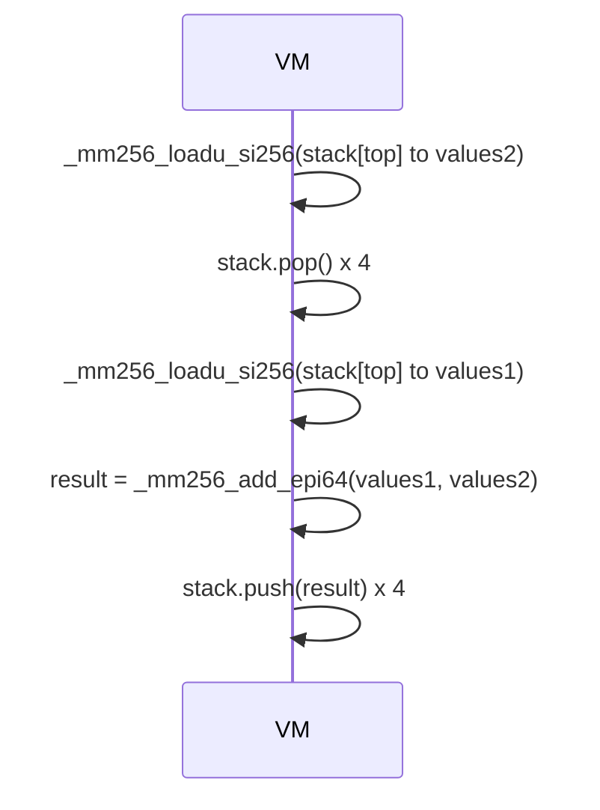
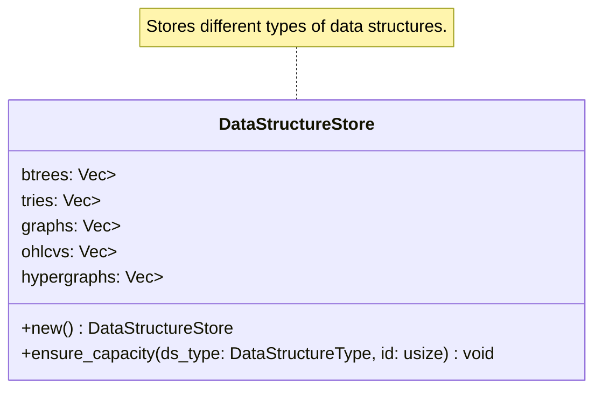
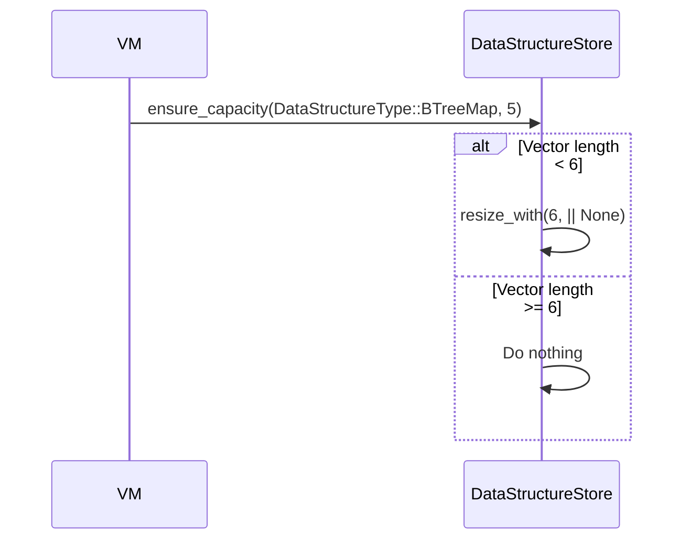
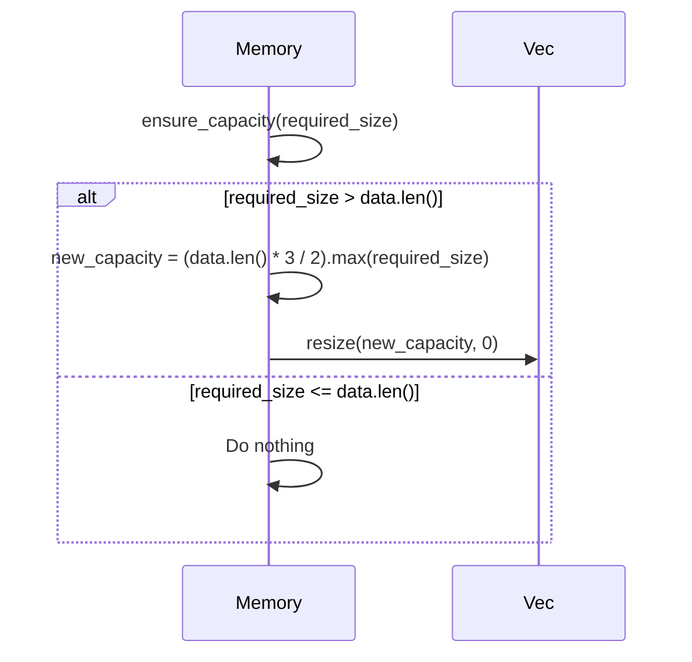
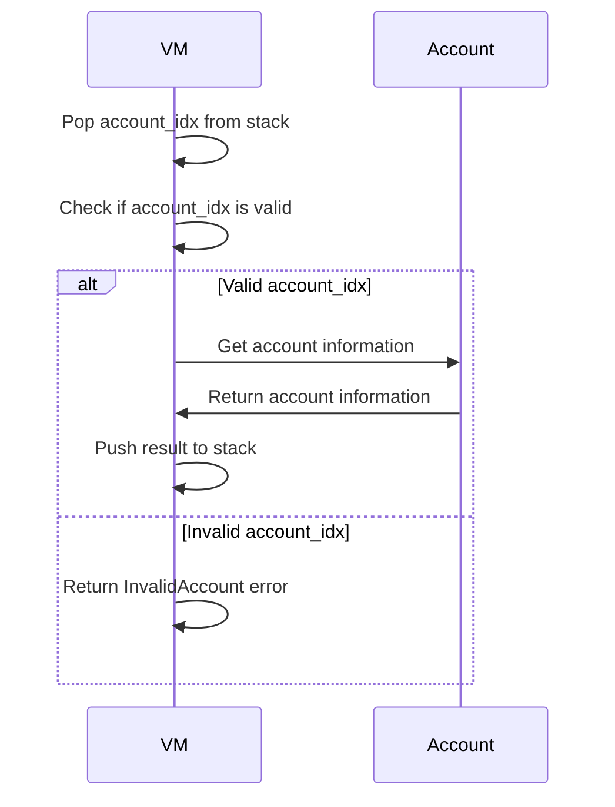
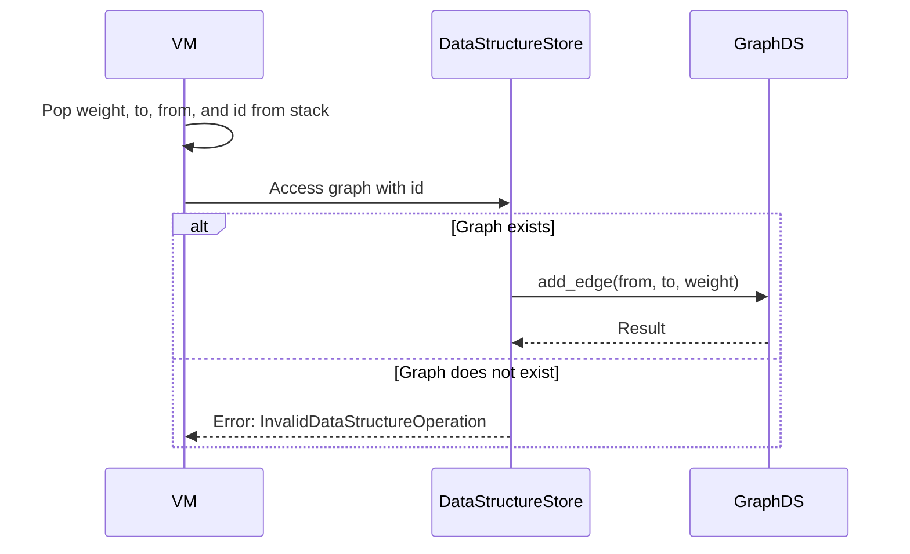
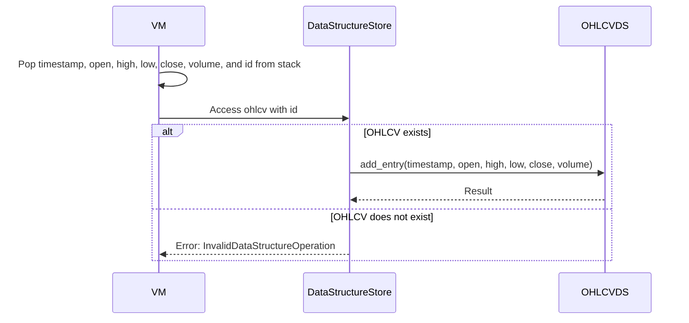
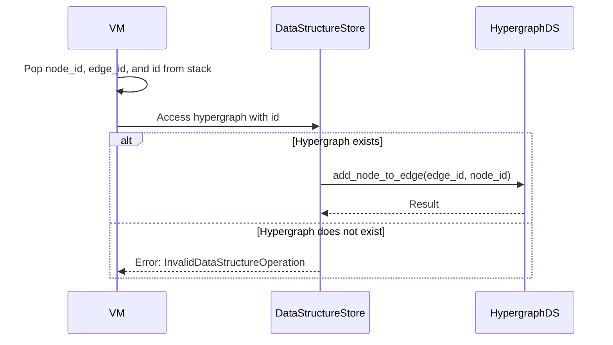

# LessVM Implementation Details

This document provides details about the implementation of LessVM, focusing on recent changes and optimizations.

## Table of Contents

- [SIMD Vector Addition](#simd-vector-addition)
- [Data Structure Store](#data-structure-store)
- [Memory Management](#memory-management)
- [Opcode Implementations](#opcode-implementations)
  - [Solana Account Operations](#solana-account-operations)
  - [Graph Operations](#graph-operations)
  - [OHLCV Operations](#ohlcv-operations)
  - [Hypergraph Operations](#hypergraph-operations)

## SIMD Vector Addition

The `vector_add` function uses SIMD (Single Instruction, Multiple Data) instructions to efficiently add multiple values at once. The implementation loads two vectors from the stack and adds them together.

The function works as follows:
1. Load the second vector (values2) from the top of the stack
2. Pop the first 4 values from the stack
3. Load the first vector (values1) from the new top of the stack
4. Add the two vectors together using SIMD instructions
5. Push the result back onto the stack

This approach ensures that we're adding two different vectors together, rather than adding a vector to itself.

## Data Structure Store

The `DataStructureStore` manages various data structures used by the VM, including BTreeMaps, Tries, Graphs, OHLCV, and Hypergraphs.

The `ensure_capacity` method ensures that the vectors have enough capacity to store a data structure at a specific index. If the index is beyond the current length of the vector, the vector is resized to accommodate the new index.

## Memory Management

The memory management system has been optimized to use a more efficient growth strategy. Instead of doubling the capacity when more space is needed, the new implementation grows the memory by 50% or to the required size, whichever is larger.

This approach reduces memory waste while still providing amortized constant-time operations.

## Opcode Implementations

### Solana Account Operations

The following Solana account operations have been implemented:

- `GetBalance`: Gets the balance (lamports) of an account
- `GetOwner`: Gets the owner of an account
- `IsWritable`: Checks if an account is writable
- `IsSigner`: Checks if an account is a signer

### Graph Operations

The following graph operations have been implemented:

- `GraphAddEdge`: Adds an edge to a graph
- `GraphGetNode`: Gets the value of a node
- `GraphSetNode`: Sets the value of a node
- `GraphGetNeighbors`: Gets the neighbors of a node
- `GraphBfs`: Performs a breadth-first search starting from a node
- `GraphClear`: Clears a graph

### OHLCV Operations

The following OHLCV (Open-High-Low-Close-Volume) operations have been implemented:

- `OhlcvAddBar`: Adds a bar to an OHLCV
- `OhlcvGetBar`: Gets a bar from an OHLCV
- `OhlcvSma`: Calculates the Simple Moving Average (SMA) of an OHLCV

### Hypergraph Operations

The following hypergraph operations have been implemented:

- `HyperAddNode`: Adds a node to a hypergraph
- `HyperAddEdge`: Adds an edge to a hypergraph
- `HyperAddNodeToEdge`: Adds a node to an edge in a hypergraph

