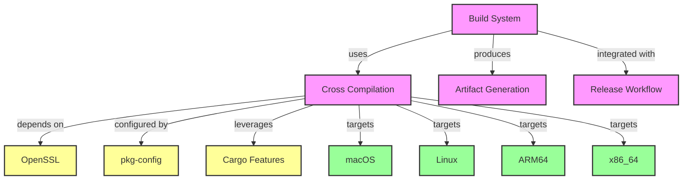

# lessVM Knowledge Graph

## System Architecture

```mermaid
graph TB
    %% Core Components
    VM_Core[VM Core]
    Stack[Stack]
    Memory[Memory]
    GasMetering[Gas Metering]
    SecurityChecker[Security Checker]
    AccountOps[Account Operations]
    ErrorHandler[Error Handler]
    InstructionSet[Instruction Set]
    Debugger[Debugger]
    SolanaRuntime[Solana Runtime]
    
    %% Testing & Deployment
    TestFramework[Test Framework]
    DeploymentSystem[Deployment System]

    %% Core Dependencies
    VM_Core --> |manages| Stack
    VM_Core --> |manages| Memory
    VM_Core --> |uses| InstructionSet
    VM_Core --> |monitored by| GasMetering
    VM_Core --> |validated by| SecurityChecker

    %% Security & Monitoring
    SecurityChecker --> |validates| Stack
    SecurityChecker --> |validates| Memory
    SecurityChecker --> |validates| AccountOps
    GasMetering --> |monitors| Stack
    GasMetering --> |monitors| Memory
    GasMetering --> |monitors| VM_Core

    %% Error Handling
    ErrorHandler --> |handles errors| VM_Core
    ErrorHandler --> |handles errors| Stack
    ErrorHandler --> |handles errors| Memory
    ErrorHandler --> |handles errors| AccountOps
    ErrorHandler --> |reports to| SolanaRuntime

    %% Solana Integration
    AccountOps --> |interfaces with| SolanaRuntime
    DeploymentSystem --> |deploys to| SolanaRuntime

    %% Debugging & Testing
    Debugger --> |monitors| VM_Core
    Debugger --> |monitors| Stack
    Debugger --> |monitors| Memory
    TestFramework --> |tests| VM_Core
    TestFramework --> |tests| Stack
    TestFramework --> |tests| Memory
    TestFramework --> |tests| AccountOps

    %% Instruction Categories
    subgraph Instructions
        StackOps[Stack Operations]
        MathOps[Math Operations]
        MemoryOps[Memory Operations]
        ControlFlow[Control Flow]
        SolanaOps[Solana Operations]
    end

    InstructionSet --> StackOps
    InstructionSet --> MathOps
    InstructionSet --> MemoryOps
    InstructionSet --> ControlFlow
    InstructionSet --> SolanaOps

    %% Component Types
    classDef core fill:#f9f,stroke:#333,stroke-width:2px
    classDef security fill:#ff9,stroke:#333,stroke-width:2px
    classDef external fill:#9f9,stroke:#333,stroke-width:2px
    classDef testing fill:#99f,stroke:#333,stroke-width:2px
    classDef instruction fill:#f99,stroke:#333,stroke-width:2px

    class VM_Core,Stack,Memory core
    class SecurityChecker,GasMetering security
    class SolanaRuntime external
    class TestFramework,Debugger testing
    class StackOps,MathOps,MemoryOps,ControlFlow,SolanaOps instruction
```

This graph visualizes the key components and relationships in the lessVM system:

1. Core Components (Pink)
   - VM Core as the central execution engine
   - Stack and Memory for data management
   - Instruction Set defining operations

2. Security & Monitoring (Yellow)
   - Security Checker validating operations
   - Gas Metering tracking resource usage
   - Error Handler managing failures

3. External Integration (Green)
   - Solana Runtime interface
   - Account Operations for blockchain interaction

4. Testing & Development (Blue)
   - Test Framework for validation
   - Debugger for execution tracing
   - Deployment System for lifecycle management

5. Instructions (Red)
   - Categorized by operation type
   - Managed by Instruction Set
   - Used by VM Core

The arrows indicate relationships:
- Solid lines show direct dependencies
- Labels describe the type of relationship
- Direction indicates dependency flow

This visualization helps understand:
- Component responsibilities
- System boundaries
- Security validations
- Resource monitoring
- Error handling paths
- Testing coverage

## Build & Deployment

The build system diagram shows:

1. Build Components (Pink)
   - Build System for compiling code
   - Cross Compilation for multi-platform support
   - Artifact Generation for creating distributable packages
   - Release Workflow for automating deployment

2. Dependencies (Yellow)
   - OpenSSL for secure communications
   - pkg-config for library detection
   - Cargo Features for conditional compilation

3. Target Platforms (Green)
   - Support for multiple operating systems (macOS, Linux)
   - Support for multiple architectures (ARM64, x86_64)

For detailed information about cross-compilation for aarch64-unknown-linux-gnu, see [Cross-Compilation Knowledge Graph](knowledge_graph_cross_compilation.html).
